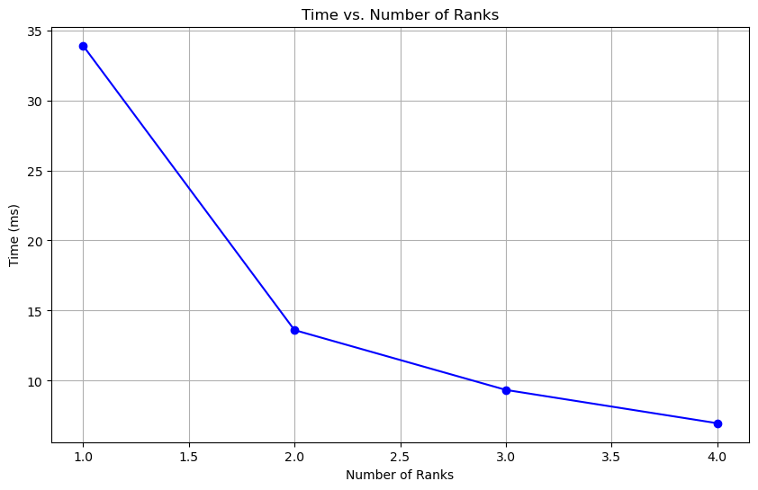
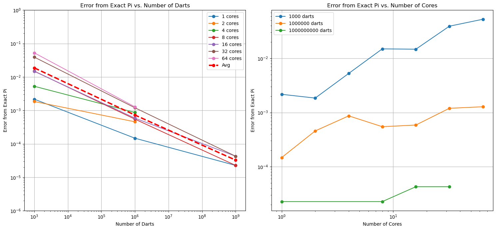
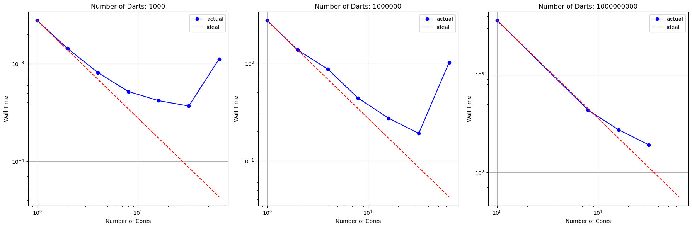
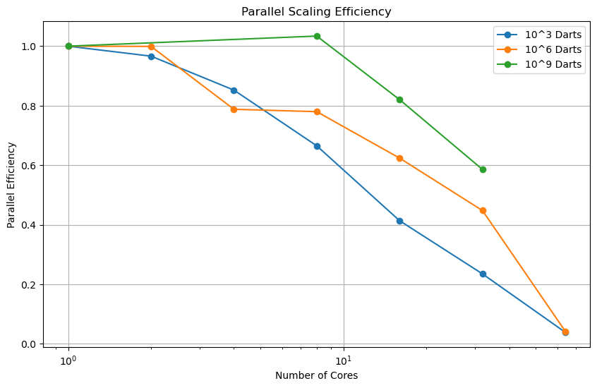

## Part 1: Warm-up Exercises
* Exercise 2.18
     
     In the second loop, which is a parallel loop, it writes to the same elements of the array 'a' without any coordination. This lack of synchronization can lead to a conflict condition where multiple threads access and modify the same memory locations simultaneously. As a result, the final values of the elements in array 'a' can be incorrect.


* Exercise 2.19

    False sharing occurs when multiple threads concurrently access different variables that are located within the same cache line. With a chunksize of 1, adjacent elements of array 'a' are likely to be stored in the same cache line, leading to unnecessary cache line invalidations and transfers between CPU caches as each thread modifies its respective element. This can significantly degrade performance. To mitigate false sharing and improve performance, it is recommended to use a larger chunksize that ensures each thread operates on a distinct portion of the data, minimizing cache line contention. The optimal chunk size depends on the architecture and specific characteristics of the hardware.


* Exercise 2.21
    
    There is still a problem left with this code: the boundary conditions from the original, global, version have not been taken into account. Give code that solves that problem.
    ```
    if (myTaskID==0 && i == 0)
        a[i] = (b[i]+bright)/2
    else if (myTaskID==nTasks-1 && i == nTasks)
    a[i] = (b[i]+bleft)/2 
    ```
    For the case of myTaskID==0, only two values are averaged, as there is no value left of the first element. For the case of myTaskID==nTasks-1, again only two values are averaged, as there is no value right of the last element.

* Exercise 2.22

    Take another look at equation (2.5) and give pseudocode that solves the problem using non-blocking sends and receives. What is the disadvantage of this code over a blocking solution?

    A non-blocking coded up solution is:

    ```
    MPI_Comm_rank(MPI_COMM_WORLD,&myTaskID);
    MPI_Comm_size(MPI_COMM_WORLD,&nTasks);
        
    if (myTaskID==0) leftproc = nTasks-1;
    else leftproc = myTaskID-1;
        
    if (myTaskID==nTasks-1)
    MPI_Isend(&x[i], 1, MPI_DOUBLE, 0, myTaskID, MPI_COMM_WORLD, &handle_send);
    else
    MPI_Isend(&x[i], 1, MPI_DOUBLE, myTaskID+1, myTaskID, MPI_COMM_WORLD, &handle_send);

    if (myTaskID==0)
    MPI_Irecv(&x_rec, 1, MPI_DOUBLE, nTasks-1, nTasks-1, MPI_COMM_WORLD, &handle_receive);
    else
    MPI_Irecv(&x_rec, 1, MPI_DOUBLE, myTaskID-1, myTaskID-1, MPI_COMM_WORLD, &handle_receive);

    MPI_Wait(&handle_receive);
        
    y[myTaskID] = y[myTaskID] + x_rec;
    ```

    The above code sends and receives when ready, and waits to do the summation until the receive is complete. It also handles the irregularities at index 0 in the array. Although this code will likely perform better than its blocked solution, it is at the expense of complicating the buffer semantics.


* Exercise 2.23
    
    To address this question effectively, we can analyze the bandwidth and latency aspects independently.

    In a purely distributed model, every node communicates directly with every other node. For example, if there are n nodes, each node needs to send messages to n-1 other nodes, resulting in a total of n*(n-1) messages. In a hybrid model, there's a centralized server. Each node now only needs to send messages to the server. This reduces the number of messages sent. Resulting in n messages in total. (since there's only one message at a time on the bandwidth). Hence, the hybrid model offers significant bandwidth savings compared to the purely distributed model, as it diminishes the volume of messages transmitted across the constrained bandwidth.

    In a purely distributed model, messages must traverse the network directly between nodes, potentially resulting in increased latency as each message independently traverses the network. Conversely, in a hybrid model, messages are routed through a centralized server. While this may introduce additional latency due to the intermediary step, it has the potential to be lower than the latency experienced in the purely distributed model, especially if the centralized server is strategically positioned and the network infrastructure is optimized.


* Exercise 2.27

    Border Case 1: Computation Takes Zero Time, Only Communication:

    All resources are dedicated to communication tasks without any time spent on computation.The gain from overlapping computation and communication would be maximal since there is no overlap. Any overlap in this case would reduce the time spent on communication without impacting computation time.

    Border Case 2: Only Computation, No Communication:

    All resources are dedicated to computation, and there is no time spent on communication. Overlapping computation and communication in this case is irrelevant since there is no communication to overlap with computation.

    General Case 3: Both computation and communication occur simultaneously:

    There is some overlap between them. The gain from overlapping computation and communication in this case depends on several factors:
    The extent to which computation and communication can be overlapped without affecting the overall performance.
    The nature of the tasks being performed and their dependencies. Some tasks may require data from communication before computation can proceed, while others may not. The efficiency of the system in managing and coordinating overlapping tasks. By optimizing the overlap between computation and communication, it's possible to reduce the overall execution time of a task or process.


## Part 2 
   (skipped)
## Part 3 MPI Basic


* 2. The output generated by the code was:

   ```
   Hello, World!
   ```
* 3. This time the output generated by the code was:

   ```
   Hello, World!
   Hello, World!
   Hello, World!
   Hello, World!
   ```
   The repeated "Hello, World!" output shows that the code successfully ran in parallel with 4 processes, each generating its own "Hello, World!" message.
* 4. by putting print command in different locations we got this result: 

   ```
   before INIT
   before INIT
   before INIT
   before INIT
   Hello, World!
   After Finalize
   After Finalize
   After Finalize
   After Finalize
   ```
    The repeated "before INIT" and "After Finalize"  messages indicate that the print statement before MPI initialization and after finalization is executed multiple times, potentially by each process. 
    The "Hello, World!" message appears only once, indicating that the main program code is executed only once

* 5 - Exercises from book:


     * Exercise  2.3 : 
     * Exercise  2.4 : 
When summing 8 elements with 4 processors, not all edges in the communication graph of Figure 2.3 correspond to actual communications due to the uneven distribution of elements among processors, resulting in processors with non-overlapping partial sums that don't need to communicate directly. In contrast, when summing 16 elements with 4 processors, all edges in the communication graph represent actual communications since each processor holds a subset of elements that necessitates communication with another processor to exchange partial sums, adhering to the structure depicted in Figure 2.3.

     * Exercise  2.5 : 

          1- The iterations of the inner loop are not independent because each iteration depends on the result of the previous iteration. 

          2- Similarly, the iterations of the outer loop are not independent because each iteration depends on the result of the previous iteration of the same loop.

          3- Given that `x[1,1]` is known, `x[2,1]` and `x[1,2]` can be computed independently. This is because `x[2,1]` only depends on `x[1,1]` and `x[2,0]`, while `x[1,2]` only depends on `x[1,1]` and `x[0,2]`. Since `x[2,0]` 
           and `x[0,2]` do not depend on each other, `x[2,1]` and `x[1,2]` can be computed independently.

          4- This observation indeed gives an idea for a parallelization strategy. Since computations for `x[i,j]` can be parallelized for independent cells, a parallel algorithm could distribute these computations across 
            multiple processors. For example, each processor could be responsible for computing a subset of the independent cells, allowing for concurrent computation and potentially speeding up the overall computation.


See the code in [Part3-MPI-Basic folder](./Part3-MPI-Basic)


## Part 4: Eat Some Pi 

* 1-
* 2- It is observable that changing the number of ranks doesn't significantly affect runtime since it is not distributed.

    | #  of ranks| 1 | 2 | 3 | 4|
    |:-----:|:---------:|:----------------:|:-----:|:------:|
    |   Time (ms)  |   27.371   | 27.468 | 27.478 |  27.558   |


* 3- In this case, we can observe that changing the number of ranks decreases runtime.

    | #  of ranks | 1 | 2 | 3 | 4|
    |:-----:|:---------:|:----------------:|:-----:|:------:|
    |   Time (ms)  |   33.900   | 13.610 | 9.341 |  6.965   |

    


* 4-

    For 1E3 darts:

    | cores | wall_time   | pi      | darts      | rounds |
    |-------|-------------|---------|------------|--------|
    | 1     | 0.00276148  | 3.14376 | 1000       | 100    |
    | 2     | 0.00142855  | 3.14344 | 1000       | 100    |
    | 4     | 0.000809804 | 3.13632 | 1000       | 100    |
    | 8     | 0.000518852 | 3.12663 | 1000       | 100    |
    | 16    | 0.000417189 | 3.12685 | 1000       | 100    |
    | 32    | 0.000367044 | 3.10236 | 1000       | 100    |
    | 64    | 0.00111323  | 3.08886 | 1000       | 100    |

    For 1E6 darts:

    | cores | wall_time   | pi      | darts      | rounds |
    |-------|-------------|---------|------------|--------|
    | 1     | 2.73034     | 3.14174 | 1000000    | 100    |
    | 2     | 1.36615     | 3.14205 | 1000000    | 100    |
    | 4     | 0.866184    | 3.14246 | 1000000    | 100    |
    | 8     | 0.437515    | 3.14214 | 1000000    | 100    |
    | 16    | 0.273487    | 3.14218 | 1000000    | 100    |
    | 32    | 0.190529    | 3.14279 | 1000000    | 100    |
    | 64    | 1.01423     | 3.14287 | 1000000    | 100    |

    For 1E9 darts:

    | cores | wall_time   | pi      | darts      | rounds |
    |-------|-------------|---------|------------|--------|
    | 1     | 3600        | 3.14157 | 1000000000 | 100    |
    | 8     | 435.206     | 3.14157 | 1000000000 | 100    |
    | 16    | 274.275     | 3.14155 | 1000000000 | 100    |
    | 32    | 192.022     | 3.14155 | 1000000000 | 100    |


* 5-

    

    The rate of convergence appears to be almost linear with the number of darts for computing pi. Computing the slope of the average, assuming linearity, and using the coordinates for 1e3 darts and 1e9 darts, we estimate the slope to be -2.16E-12. This is the estimated rate of convergence. This does make sense, as error decreases as the number of darts increases, and assuming true randomness, this is a reasonable conclusion for the experiment. The rate of convergence does not appear to vary with processor count and this also makes sense; the distribution of embarrassingly parallel tasks across multiple processors should not affect the end result. Here, it does not and should not.

* 6-

    

    

    The parallel performance varies with the number of darts utilized. When fewer darts are employed, efficiency decreases rapidly as the number of processors increases. For smaller dart counts or problem sizes, it is generally more advantageous to execute computations sequentially. However, as the problem size expands, greater efficiency is achieved with an increasing number of processors. This phenomenon is likely attributed to computations becoming compute-bound for larger problem sizes, with any slowdowns from data transfer becoming negligible. In summary, the strong scaling problem of computing pi using this project's methodology demonstrates greater efficiency across multiple processors with larger problem sizes.

* 7-


